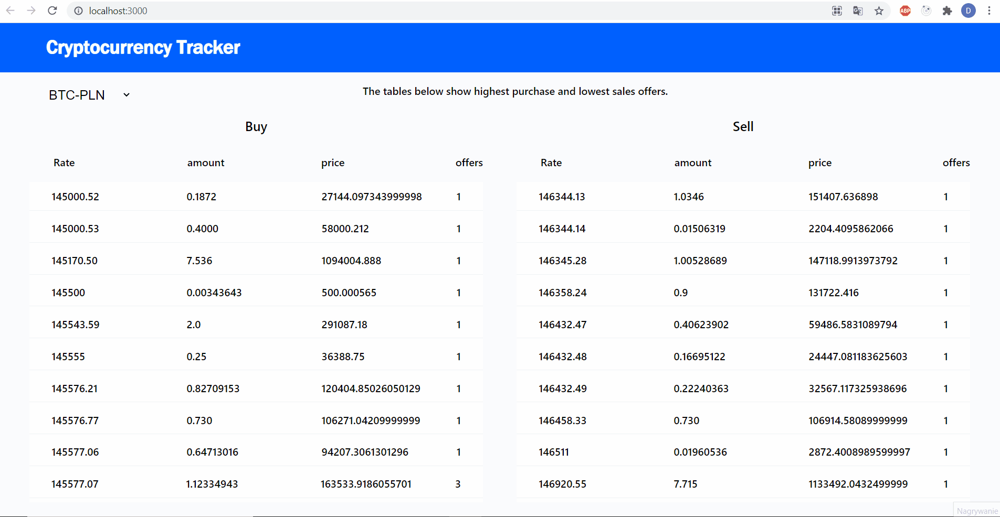

# Cryptocurrency-Tracker

&nbsp;

# Table of contents

1. [What is this repository about](#introduction)
2. [Tools and external libraries used for the project](#tools)
3. [Presentation of the project](#presentation)
4. [How to view the project](#installation)
5. [Contact](#Contact)
6. [License](#License)
7. [Acknowledgments](#Acknowledgments)
   &nbsp;

---

### What is this repository about

#### Cryptocurrency Tracker project is a repository in which I have made a simple website using API to let the user track different cryptocurrencies and their buy/sell price in relation to PLN.

## &nbsp;

### Tools and external libraries used for the project

1.  HTML 5
2.  CSS 3
3.  React
4.  React Hooks
5.  [Flexbox](https://css-tricks.com/snippets/css/a-guide-to-flexbox/)
6.  [BitBay API](https://docs.bitbay.net/reference#orderbook-2)
    &nbsp;

---

### Presentation of the Project

&nbsp;

&nbsp;

### How to view the project

#### In order to see the project simply clone the repository and run it in your browser.

## &nbsp;

### Contact

#### You can contact me via my personal Email: dawidk65@gmail.com

## &nbsp;

### License

#### This project is licensed under the MIT License

## &nbsp;

### Acknowledgments

#### Cryptocurrency Tracker project is a repository in which I have made a simple website using API to let the user track different cryptocurrencies and their buy/sell price in relation to PLN.

&nbsp;
